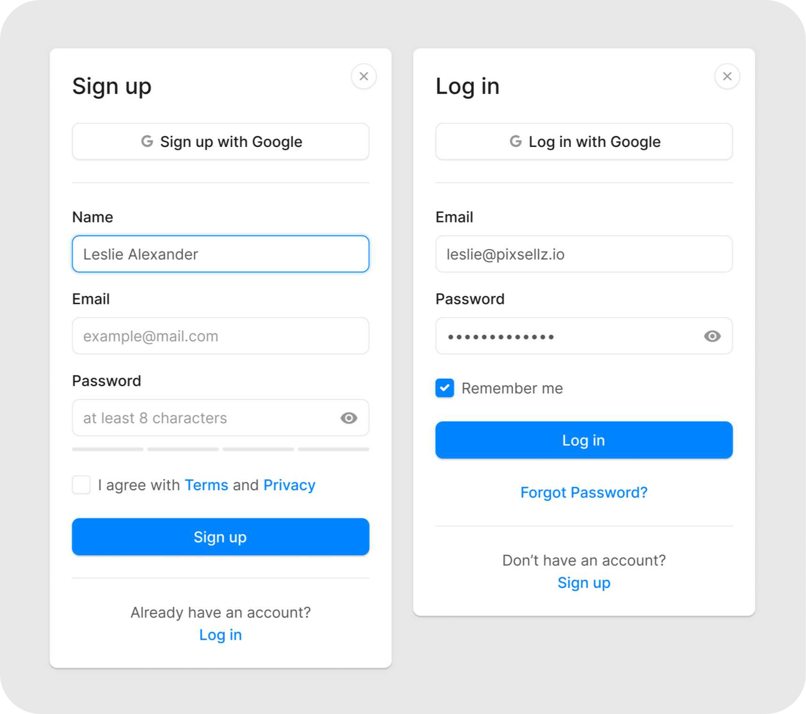

# feature/login-signup

### Contributors:

- [Robin Kataria](https://github.com/robinkataria) _(Developer)_
- [Sharvan Sharma](https://github.com/sharvan-sharma) _(Reviewer)_

### About

**Login-Signup** are styled HTML pages for login and sign up on a web-app. At often places, Javascript is used to add form validations, password view-hide toggle function and multiple other event listeners.

I have developed these pages by referring to below [🔗Dribbble](https://dribbble.com/shots/16502934-Sign-up-Log-in) design.

[]

### How to run

1. Create a local copy of code by [clonning this repository](https://docs.github.com/en/repositories/creating-and-managing-repositories/cloning-a-repository#:~:text=to%20a%20project.-,Cloning%20a%20repository,-On%20GitHub.com) to your computer.
2. Open index.html file or run live server.

### Other information

#### Tech used

- JavaScript
- HTML5
- CSS3

#### My learning

- CSS Flexbox and Position property
- BEM naming convention
- Normalize CSS vs Reset CSS
- Relative and Absolute File paths
- JavaScript IIFE - Immediately invoked function expression
- Add or remove element by JavaScript
- <script> tag attributes (defer, async)
- Application of different Event listeners (DOMContentLoaded, click, submit, etc)
- Regular expression for form validation
- READMEmd file maintainance

#### Colors used

- #0084FF - Blue submit button, input:focus border, hyperlinks
- #585757 - User input, span text
- #969696 - Placeholder
- #1C1C1C - Black headings
- #E7E7E7 - Grey page background, input border, form border, hr
- #FFFFFF - White form background
